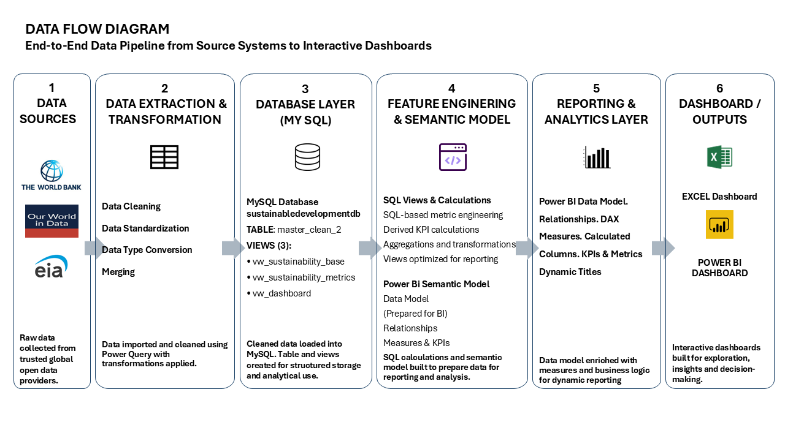

# Global-Energy-Consumption-Sustainability-Analysis

An end-to-end data analytics project exploring how economic, demographic, and sustainability factors relate to national energy consumption and carbon emissions across 210+ countries.

**Tools**: Excel | SQL | Power Query | Power BI | MySQL | World Bank | Our World in Data | EIA

**Project Summary**

This project combines 7 public datasets from 3 international sources to build a unified analytical model of global energy and sustainability performance. 

It includes data cleaning, database design, feature engineering, exploratory analysis, regression analysis, and dashboard development in Excel and Power BI.

**Business Question**

How well do GDP, population, and sustainability indicators explain differences in energy consumption and carbon emissions across countries?

**What I Did**

Collected and integrated data from World Bank, Our World in Data, and EIA.
Cleaned and standardized country-level datasets.
Built a MySQL database to structure and validate the data.
Created 5 derived metrics to improve analysis:
  Energy consumption per capita
  CO₂ emissions per capita
  Carbon intensity
  Renewable energy share
  Income group classification
Performed exploratory analysis and regression modelling.
Built 2 interactive dashboards in Excel and Power BI.
Designed KPI tracking, slicers, filters, and country-level comparisons.

**Data Architecture **

**Data Sources**
7 datasets from 3 international public data sources 210+ countries 
10+ economic and sustainability indicators 
2021–2024 reporting period
World Bank Open Data: GDP, Population, CO₂ Emissions, Renewable Energy & GNI Classification
Our World in Data: CO₂ emissions
U.S. Energy Information Administration (EIA): Rankings about energy in the World

**Methodology**

 **1. Data Collection**
  1.1	Data were collected from multiple publicly available sources to provide a comprehensive view of global economic, demographic and environmental indicators.
  1.2	The datasets included:
  1.3	World Bank Open Data 
  1.4	Our World in Data 
  1.5.	U.S. Energy Information Administration (EIA) 
  1.6	These datasets were selected to combine economic, population, energy consumption and environmental sustainability indicators at the country level.

**2. Data Preparation**
Cleaned and integrated seven independent datasets, standardizing country names across 210+ observations, validating data integrity, resolving missing values and creating a unified analytical dataset. 

**3. Database Development**
The cleaned datasets were imported into a MySQL relational database.
SQL was used to:
    •	Store and organize the data 
    •	Query and validate records 
    •	Prepare datasets for downstream analysis 
    •	Support reproducible data processing 

**4. Feature Engineering**
Developed five derived analytical metrics to extend the original assignment:
  •	Energy Consumption per Capita 
  •	CO₂ Emissions per Capita 
  •	Carbon Intensity 
  •	Renewable Energy Share 
  •	Income Group Classification
These variables provided additional context for exploring sustainability and energy consumption.

**5. Exploratory Data Analysis**
Scatter plots, descriptive statistics and regression analysis were used to investigate relationships between variables.
The analysis explored:
  •	GDP per capita vs. Energy Consumption 
  •	Renewable Energy Share vs. CO₂ Emissions 
  •	Differences between World Bank income groups 
  •	Carbon intensity across countries 
  Regression trendlines and R² values were used to assess the strength of the observed relationships.

**Dashboard Development**

Designed and developed two executive dashboards comprising:
  •	8+ KPI cards 
  •	10+ interactive charts 
  •	Dynamic country selector 
  •	Income-group segmentation 
  •	Regression analysis 
  •	What-If scenario analysis 
  •	Executive summary panel

  **Excel Executive Dashboard**

**Dashboard Highlights**

  •	1 interactive executive dashboard 
  •	4 KPI cards 
  •	5 analytical visualisations 
  •	1 dynamic country selector 
  •	1 What-If analysis model 
  •	210+ countries analysed 
  •	Income group comparisons 
  •	Regression trend analysis

**Interactive Power BI Dashboard**

**Power BI Dashboard Highlights**

  •	1 interactive report page 
  •	Dynamic slicers 
  •	Cross-filtering 
  •	DAX measures 
  •	Interactive KPI reporting 

**Key Energy and Sustainability Insights**

**Wealth Comes with a Carbon Price**

The top six oil-rich economies emit approximately 555,152 tonnes of CO₂ per US$1 billion of GDP—about 2.3× more CO₂ per dollar of GDP than the global average. Despite having some of the world's highest solar irradiance, their renewable energy share averages only 0.3%.
    
**Norway Shows Another Way**

Norway, one of the world's highest-income countries by GDP per capita, generates more than 60% of its domestic energy from renewable sources, primarily hydropower, while maintaining per-capita CO₂ emissions about 3.7× lower than the average of the Gulf oil-producing countries.
    
**The Renewable Energy Paradox**

High-income countries have an average GDP per capita 68× higher than low-income countries (US$50,553 vs. US$747). However, low-income countries have the highest average renewable energy share (over 80%), whereas the top five high-income countries have renewable energy shares below the global average of 30%.
    
**Proof That Sustainable Growth Is Possible**

Countries such as Uruguay, Paraguay, Guatemala, and Brazil demonstrate that economic development can coexist with low emissions and high renewable energy adoption, with renewable energy shares of 57.8%, 58.8%, 62.1%, and 46.5%, respectively.

**Challenges Solved**
 
  Inconsistent country naming across datasets.
  Missing values in developing-country records.
  Different reporting years across sources.
  Unit standardization and data harmonization.

## Skills Demonstrated

| **Skill** | **Evidence** |
|----------------|------------------------------------------|
| **SQL** | Advanced analytical queries using `SELECT`, `WHERE`, `GROUP BY`, `HAVING`, `ORDER BY`, `LIMIT`, `CASE`, subqueries, views, aggregate functions, window functions (`RANK`), `NULLIF`, `ROUND`, and data validation techniques|
| **ETL** | Data cleaning, transformation, standardization with Power Query |
| **Database Design** | MySQL relational schema, SQL views, reporting integration |
| **Statistical Analysis** | Linear regression and sustainability indicator analysis |
| **Power BI Development** | Created four DAX measures, dynamic KPI reporting, interactive slicers, filters, and report navigation. |
| **Excel Development** | Built advanced Excel dashboards using PivotTables, PivotCharts, Power Query, INDEX-MATCH, SUMIFS, COUNTIFS, Data Validation, Conditional Formatting, Named Ranges, and interactive controls. |
| **Data Visualization** | 10+ interactive charts and executive dashboards |
| **Business Analysis** | Produced evidence-based insights and recommendations supporting sustainability strategy, environmental performance monitoring, and policy evaluation. |
| **Documentation** | Produced comprehensive technical documentation, including SQL documentation, DAX documentation, architecture diagrams, workflow diagrams, and GitHub project documentation. |
| **Version Control** | Professional GitHub repository with reproducible project structure. |

**Repository Structure**

Global-Energy-Consumption-Sustainability-Analysis/
│
── README.md
│
├── Data/
│ ├── Raw Data/
│ ├── Clean Data in Excel/
│ └── Data Dictionary.xlsx
│
├── SQL/
│ ├── 01_Create_Database_and_Table.sql
│ ├── 02_Data_Validation.sql
│ ├── 03_Create_Views.sql
│ ├── 04_Business_Analysis_Queries.sql
│ ├── Data_Flow_Diagram.png
│ └── SQL_Technical_Documentation.docx
│
├── Excel Dashboard/
│ ├── Global Energy Dashboard.xlsx
│ ├── Dashboard.pdf
│ └── Excel_Formula_Documentation.docx
│
├── Power BI/
│ ├── Global Energy Dashboard.pbix
│ ├── Dashboard.pdf
│ └── Power_BI_DAX_Measures_Documentation.docx
│
├── Images/
│
└── Documentation/
├── Original_Academic_Assignment_Brief.pdf
└── Project_Architecture_Diagram.pptx

**Future Improvements**

  Add regression diagnostics and statistical testing.
  Build the workflow in Python for automation and reproducibility.
  Create an automated ETL pipeline.
  Add forecasting for energy demand and emissions.
  Include more sustainability indicators.
  Deploy the solution in a cloud environment.

  **Gianni-Ioannis Poulis**

Data Analyst | Operations Analyst | Sustainability Analyst

- LinkedIn: Gianni-Ioannis Poulis

